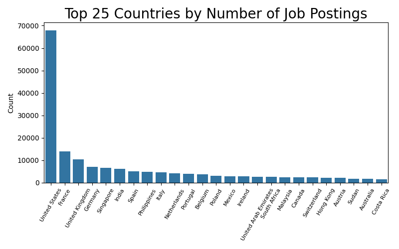
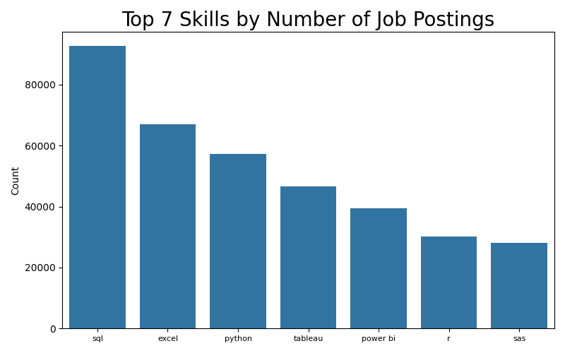
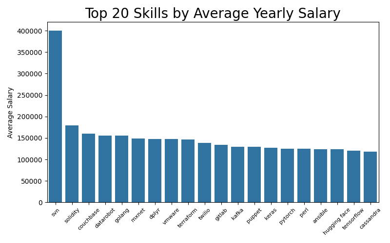
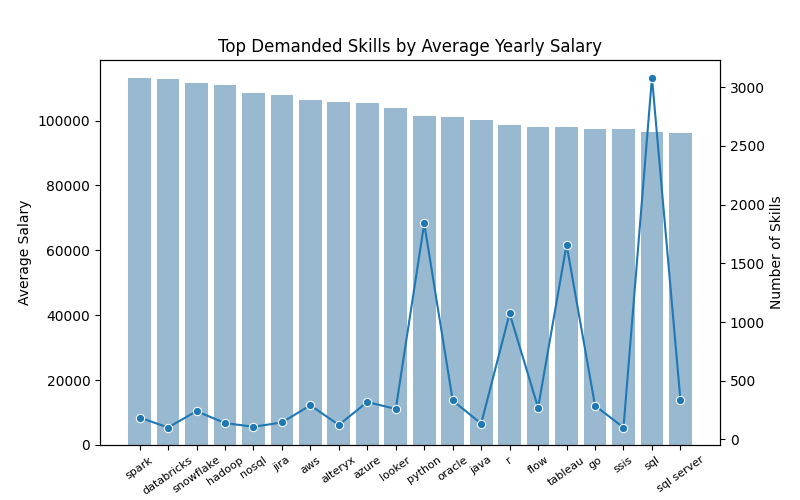

# Job Postings Analysis with SQL and Python  
_________________________________________________________________

## Data Analyst Job Postings

  
  
  
### The highest paid data analyst skills that are also much in demand:
 
_________________________________________________________________

### Setup
Import required packages: pip install -r requirements.txt -v  
_________________________________________________________________

### Data Source
https://www.lukebarousse.com/sql: 

### DBMS  
PostgreSQL  

### IDE  
VSC 1.92.1  
